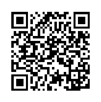
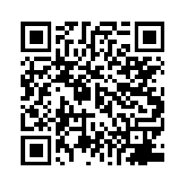

# Laravel Telegram Bot

## Installation

## Semantic versioning

A version consists of three parts: **MAJOR**.**MINOR**.**PATCH**. Version 1.2.3 of a package could be referred to as a package on major version 1, minor version 2, patchlevel 3.
  
**Major**: contains breaking changes, compared to the previous release. Consumers of our package need to make adjustments to their existing code integrating this package.
  
**Minor**: contains added functionality (e.g. new methods) which do not break existing functionality. Consumers of our package do not need to make adjustments to their existing code integrating this package.
  
**Patchlevel**: contains bug fixes, upgraded dependencies, etc. but does not contain new functionality. Consumers of our package do not need to make adjustments to their existing code integrating this package.

## Sponsoring 

Scan the QR code with your wallet application or copy the address below and paste into your wallet.  
Please feel free to donate any amount you want.

| Cryptocurrency                                                                                                      | Address                                    | QR Code                               |
|---------------------------------------------------------------------------------------------------------------------|--------------------------------------------|---------------------------------------|
| Bitcoin   [BTC Explorer](https://www.blockchain.com/btc/address/3DWxSQg2HNijAADowkQWFJsDHHpKo8Ec2z)              | 3DWxSQg2HNijAADowkQWFJsDHHpKo8Ec2z         |   |
| Ethereum    [ETH Explorer](https://www.blockchain.com/es/eth/address/0x4F4963EF52970CF6fea799659a0d5FB18E9c9e56) | 0x4F4963EF52970CF6fea799659a0d5FB18E9c9e56 |  |